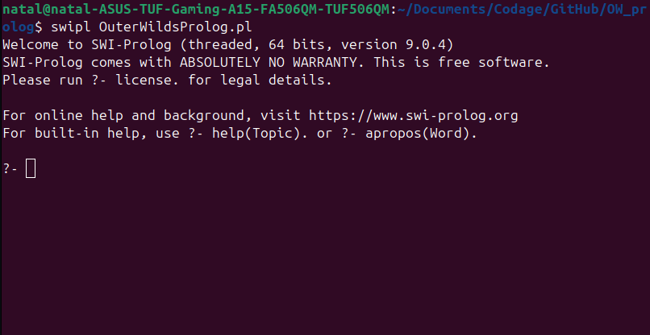
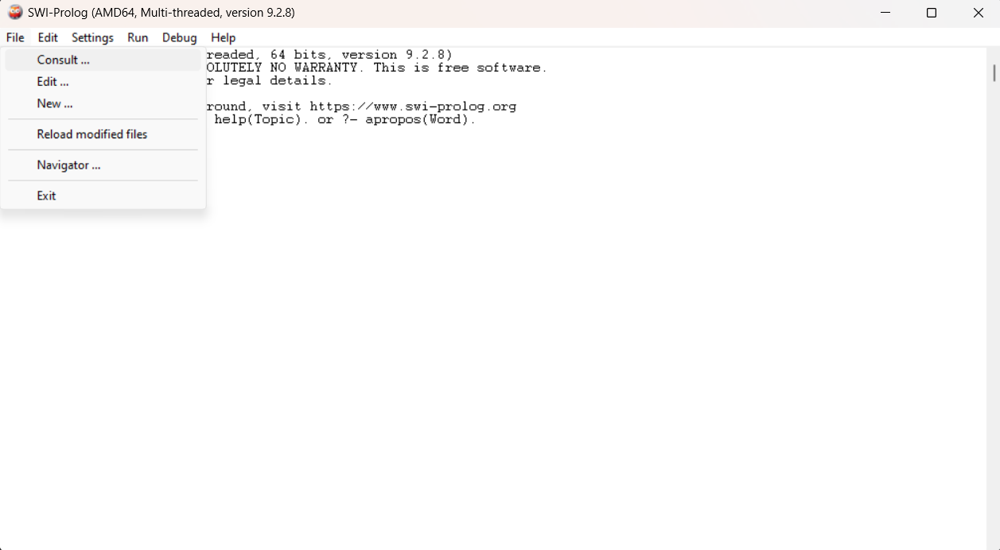

# Outer Wilds Prolog
### C'est quoi ?

Outer Wilds Prolog est un jeu d'aventure textuel dans l'univers de Outer Wilds, tous droits réservés à [Annapurna Interactive](https://annapurnainteractive.com/en). Le jeu reprend l'histoire d'Outer Wilds en la simplifiant et en omettant des passages.

Le jeu a été codé en Prolog, il faut donc de quoi interpréter du Prolog pour jouer.
Nous allons utiliser [SWI Prolog](https://www.swi-prolog.org/), une distribution libre et gratuite du langage de programmation [Prolog](https://fr.wikipedia.org/wiki/Prolog).

## Installer SWI-Prolog

### Linux

Il suffit d'ouvrir un terminal et de taper la ligne suivante : \
`$ sudo apt-get install swi-prolog` 

Le terme 'sudo' est nécessaire pour installer en mode administrateur. En fonction de votre machine, il peut être retirer.

### Windows

Vous devrez aller sur la [page de téléchargement](https://www.swi-prolog.org/download/devel) de SWI-Prolog et installer la version correspondant à votre système d'exploitation.\
Par exemple, pour installer sur un Windows en 64 bits :

## Lancer le jeu

### Linux

Pour lancer le jeu sur Linux vous devez télécharger le fichier 'OuterWildsProlog.pl' ou cloner le Github sur votre machine. Ensuite, vous aller dans un terminal et vous vous placer à l'endroit où est stocké le fichier ou le dossier Github. Il ne vous reste plus qu'à taper la commande suivante : \
`$ swipl OuterWildsProlog.pl`

A ce moment là votre terminal devrait ressembler à ceci : 

Maintenant, pour lancer le jeu, il ne reste plus qu'a taper la commande `?- jouer`.\
Les instructions s'afficheront, il ne vous reste plus qu'à jouer.

### Windows

Pour lancer le jeu sur Windows vous devez télécharger le fichier 'OuterWildsProlog.pl' ou cloner le Github sur votre machine. Vous allez ensuite ouvrir l'application SWI-Prolog et vous intéresser au menu en haut. Vous allez alors cliquer sur 'File -> Consult... -> Choisir fichier' comme ci dessous :

Le programme se lance, il ne vous reste plus qu'a taper `jouer`, qui sera affiché comme `?- jouer`, pour lancer le jeu.\
Les instructions s'afficheront, il ne vous reste plus qu'à jouer.

## Arrêter le jeu

Pour Windows comme pour Linux, il vous suffit d'utiliser `Ctrl` + `D`.\
De plus, pour Windows, puisque c'est une application vous pouvez juste fermer la fenêtre.

### Attention

Le jeu est court, il ne possède donc pas de fonctionnalité de sauvegarde.

## Crédits

Ce jeu est un projet universitaire développé au sein du module Info501 de l'Université Savoie Mont Blanc par :
- GOLDSTEIN Enzo
- FEVRE-BURDY Natal
